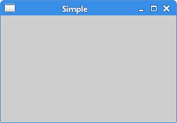
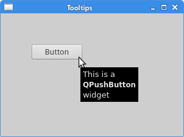
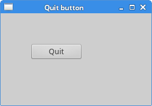
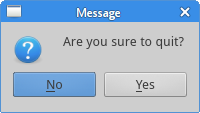

# PyQt6 的第一个程序
*最后更新于 2021.04.23*

在 PyQt6 教程的这一部分中，我们将学习一些基本功能。这些示例显示工具提示和图标、关闭窗口、显示消息框以及在桌面上居中显示窗口。
## PyQt6 简单示例
这是一个显示小窗口的简单示例。但我们可以用这个窗口做很多事情。我们可以调整它的大小、最大化或最小化它。 实现这些功能通常需要写大量的代码，但这些功能很常见，所以这部分功能已经封装好了，我们直接使用即可。PyQt6 是一个高级工具包，如果使用低级的工具包，下面的代码示例很可能需要数百行才可以实现。

``` python
# file: simple.py
#!/usr/bin/python

"""
ZetCode PyQt6 tutorial

In this example, we create a simple
window in PyQt6.

Author: Jan Bodnar
Website: zetcode.com
"""


import sys
from PyQt6.QtWidgets import QApplication, QWidget


def main():

    app = QApplication(sys.argv)

    w = QWidget()
    w.resize(250, 200)
    w.move(300, 300)

    w.setWindowTitle('Simple')
    w.show()

    sys.exit(app.exec())


if __name__ == '__main__':
    main()
```

上面的代码会再屏幕上显示一个小窗口。

``` python
import sys
from PyQt6.QtWidgets import QApplication, QWidget
```
这里引入了必要的包，基础小组件位于 `PyQt6.QtWidgets` 模块。

``` python
app = QApplication(sys.argv)
```
每个 PyQt6 应用程序都必须创建一个应用程序对象。`sys.argv` 参数是来自命令行的参数列表。Python 脚本可以从 shell 运行，这是应用启动的一种方式。

``` python
w = QWidget()
```
QWidget 小部件是 PyQt6 中所有用户界面对象的基类。我们为 QWidget 提供了默认构造函数。默认构造函数没有父级。没有父级的小部件称为窗口。
``` python
w.resize(250, 150)
```
`resize` 方法改变了小部件的尺寸，现在它250像素宽，150像素高。
``` python
w.move(300, 300)
```
`move` 方法把小部件移动到屏幕的指定坐标(300, 300)。
``` python
w.setWindowTitle('Simple')
```
使用 `setWindowTitle` 给窗口设置标题，标题显示在标题栏。
``` python
w.show()
```
`show` 方法是在屏幕上显示小部件的方法。显示一个部件的步骤是首先在内存里创建，然后在屏幕上显示。
``` python
sys.exit(app.exec())
```
最后，我们进入应用程序的主循环。事件处理从这里开始。主循环从窗口系统接收事件并将它们分派给应用程序小部件。 如果我们调用 exit 方法或主小部件被销毁，则主循环结束。`sys.exit` 方法确保一个干净的退出。环境将被告知应用程序如何结束。



Figure: Simple
## PyQt6 tooltip
我们可以为程序创建一个气泡提示。

``` python
# file: tooltip.py
#!/usr/bin/python

"""
ZetCode PyQt6 tutorial

This example shows a tooltip on
a window and a button.

Author: Jan Bodnar
Website: zetcode.com
"""

import sys
from PyQt6.QtWidgets import (QWidget, QToolTip,
    QPushButton, QApplication)
from PyQt6.QtGui import QFont


class Example(QWidget):

    def __init__(self):
        super().__init__()

        self.initUI()


    def initUI(self):

        QToolTip.setFont(QFont('SansSerif', 10))

        self.setToolTip('This is a <b>QWidget</b> widget')

        btn = QPushButton('Button', self)
        btn.setToolTip('This is a <b>QPushButton</b> widget')
        btn.resize(btn.sizeHint())
        btn.move(50, 50)

        self.setGeometry(300, 300, 300, 200)
        self.setWindowTitle('Tooltips')
        self.show()


def main():

    app = QApplication(sys.argv)
    ex = Example()
    sys.exit(app.exec())


if __name__ == '__main__':
    main()
```
该示例中，我们给两个小部件创建了一个气泡提示框。

``` python
QToolTip.setFont(QFont('SansSerif', 10))
```

这个静态方法给气泡提示框设置了字体，这里使用了10pt 的 SansSerif 字体。

``` python
self.setToolTip('This is a <b>QWidget</b> widget')
```

调用 `setTooltip` 方法创建气泡提示框，可以使用富文本内容。

``` python
btn = QPushButton('Button', self)
btn.setToolTip('This is a <b>QPushButton</b> widget')
```

在气泡提示框上添加了一个按钮部件。

``` python
btn.resize(btn.sizeHint())
btn.move(50, 50)
```
`sizeHint` 方法是给按钮一个系统建议的尺寸，然后使用 `move` 方法移动这个按钮的位置。


Figure: Tooltips
## PyQt6 退出按钮
关闭窗口的明显方法是单击标题栏上的 x 标记。在下一个示例中，我们将展示如何以编程方式关闭窗口。 我们将简要介绍信号和插槽。

本例中使用 `QPushButton` 部件完成这个功能。
``` python
QPushButton(string text, QWidget parent = None)
```
参数 `text` 是将显示在按钮上的文本。`parent` 是我们放置按钮的小部件。在我们的例子中，它将是一个`QWidget`。应用程序的小部件形成层次结构，在这个层次结构中，大多数小部件都有父级。没有父级的小部件的父级是顶级窗口。

```python
# file: quit_button.py
#!/usr/bin/python

"""
ZetCode PyQt6 tutorial

This program creates a quit
button. When we press the button,
the application terminates.

Author: Jan Bodnar
Website: zetcode.com
"""

import sys
from PyQt6.QtWidgets import QWidget, QPushButton, QApplication

class Example(QWidget):

    def __init__(self):
        super().__init__()

        self.initUI()


    def initUI(self):

        qbtn = QPushButton('Quit', self)
        qbtn.clicked.connect(QApplication.instance().quit)
        qbtn.resize(qbtn.sizeHint())
        qbtn.move(50, 50)

        self.setGeometry(300, 300, 350, 250)
        self.setWindowTitle('Quit button')
        self.show()


def main():

    app = QApplication(sys.argv)
    ex = Example()
    sys.exit(app.exec())


if __name__ == '__main__':
    main()
```
本例创建了一个退出按钮，点击此按钮退出程序。
``` python
qbtn = QPushButton('Quit', self)
```
我们创建了一个按钮，它是 `QPushButton` 类的一个实例。构造函数的第一个参数是按钮的标签。 第二个参数是父级小部件。父小部件是 `Example` 小部件，它继承自 `QWidget`。
``` python
qbtn.clicked.connect(QApplication.instance().quit)
```
PyQt6 的事件处理系统是由信号和插槽机制构成的，点击按钮（事件），会发出点击信号。事件处理插槽可以是 Qt 自带的插槽，也可以是普通 Python 函数

使用 `QApplication.instance` 获取的 `QCoreApplication` 对象包含主事件循环————它处理和分派所有事件。 单击的信号连接到终止应用程序的退出方法。 通信是在两个对象之间完成的：发送者和接收者。 发送者是按钮，接收者是应用程序对象。



Figure: Quit button

## PyQt6 弹窗
默认情况下，如果我们点击标题栏上的 x 按钮，`QWidget` 会被关闭。有时我们想修改这个默认行为。 例如，如果在编辑器中打开了一个文件，修改了部分内容，我们需要显示一个消息框来确认退出程序的操作。

``` python
# file: messagebox.py
#!/usr/bin/python

"""
ZetCode PyQt6 tutorial

This program shows a confirmation
message box when we click on the close
button of the application window.

Author: Jan Bodnar
Website: zetcode.com
"""

import sys
from PyQt6.QtWidgets import QWidget, QMessageBox, QApplication


class Example(QWidget):

    def __init__(self):
        super().__init__()

        self.initUI()

    def initUI(self):

        self.setGeometry(300, 300, 350, 200)
        self.setWindowTitle('Message box')
        self.show()

    def closeEvent(self, event):

        reply = QMessageBox.question(self, 'Message',
                    "Are you sure to quit?", QMessageBox.StandardButtons.Yes |
                    QMessageBox.StandardButtons.No, QMessageBox.StandardButtons.No)

        if reply == QMessageBox.StandardButtons.Yes:

            event.accept()
        else:

            event.ignore()


def main():
    app = QApplication(sys.argv)
    ex = Example()
    sys.exit(app.exec())


if __name__ == '__main__':
    main()
```
关闭 `QWidget` 操作会产生 `QCloseEvent` 事件。重新实现 `closeEvent` 事件处理，替换部件的默认行为。

``` python
reply = QMessageBox.question(self, 'Message',
                             "Are you sure to quit?", QMessageBox.Yes |
                             QMessageBox.No, QMessageBox.No)
```
这里创建了一个带有两个按钮的消息框：是和否。第一个参数是标题栏，第二个参数是对话框显示的消息文本，第三个参数是对话框中的按钮组合，最后一个参数是默认选中的按钮。返回值存储在变量 `replay` 中。

``` python
if reply == QtGui.QMessageBox.Yes:
    event.accept()
else:
    event.ignore()
```
对返回值进行判断，如果单击 Yes 按钮，执行小部件关闭和终止应用程序，否则我们忽略关闭事件。



Figure: Message box

## PyQt6 窗口居中
下面的脚本会在屏幕上显示一个居中的窗口。
``` python
# file: center.py
#!/usr/bin/python

"""
ZetCode PyQt6 tutorial

This program centers a window
on the screen.

Author: Jan Bodnar
Website: zetcode.com
"""

import sys
from PyQt6.QtWidgets import QWidget, QApplication


class Example(QWidget):

    def __init__(self):
        super().__init__()

        self.initUI()

    def initUI(self):

        self.resize(350, 250)
        self.center()

        self.setWindowTitle('Center')
        self.show()

    def center(self):

        qr = self.frameGeometry()
        cp = self.screen().availableGeometry().center()

        qr.moveCenter(cp)
        self.move(qr.topLeft())


def main():

    app = QApplication(sys.argv)
    ex = Example()
    sys.exit(app.exec())


if __name__ == '__main__':
    main()
```
`QScreen` 类可以查询屏幕属性。
``` python
self.center()
```
使用自定义 `center` 方法居中显示窗口。
``` python
qr = self.frameGeometry()
```
这样就可以得到一个矩形的窗口，这里可以放置所有类型的窗口。
``` python
cp = self.screen().availableGeometry().center()
```
从屏幕属性里计算出分辨率，然后计算出中心点位置。
``` python
qr.moveCenter(cp)
```
我们已经知道矩形窗口的宽高，只需要把矩形窗口的中心点放置到屏幕窗口的中心点即可。这不会修改矩形窗口的大小。
``` python
self.move(qr.topLeft())
```
把应用窗口的左上方点坐标移动到矩形窗口的左上方，这样就可以居中显示了。

本章教程，我们创建了一个简单的 PyQt6 应用。